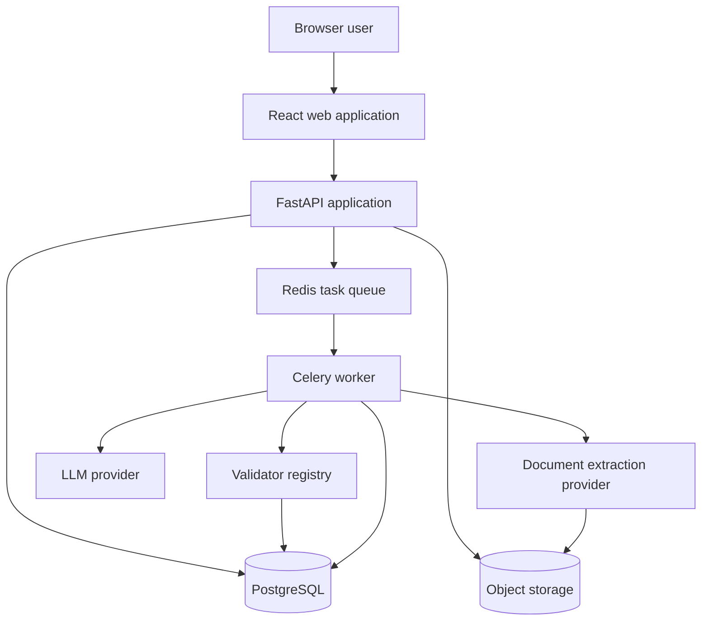
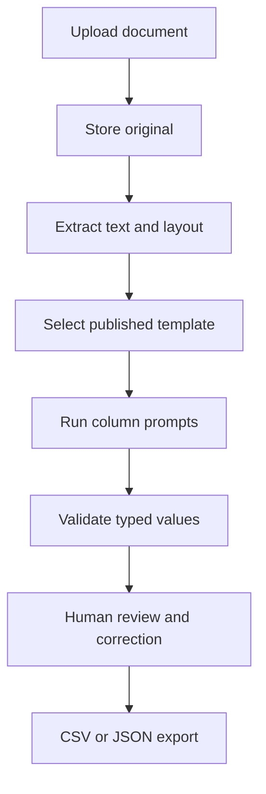
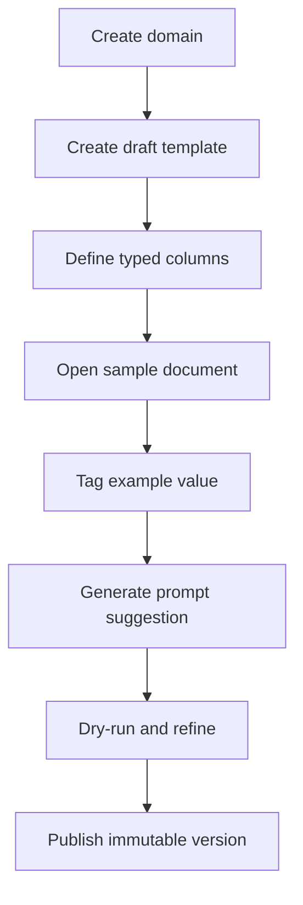

# Document Parsing System — Canonical Development Plan

**Project:** Prompt-Driven Document Parsing and Template Extraction System  
**Reference domain:** Agent Bank Interest and Payment Notices  
**Status:** Canonical implementation roadmap  
**Implementation status:** Not started  
**Source:** Requirements Specification version 1.0, dated August 17, 2026

---

## 1. Application Overview

This application converts unstructured documents into structured, reviewable data.

A business analyst creates a reusable parsing template for a document domain such as Agent Bank Notices. The template contains columns such as Notice Date, Borrower Name, Interest Amount, and Payment Due Date. Each column has a data type and an extraction prompt.

An operations user uploads a document and selects a compatible template. The system:

1. Stores the original document.
2. Sends it to a document text-extraction/OCR service.
3. Preserves extracted text, page numbers, and text locations.
4. Sends the document text and template prompts to an LLM.
5. Requests structured JSON output.
6. Validates each extracted value against its declared type.
7. Retries invalid responses.
8. Flags unresolved values for human review.
9. Allows a reviewer to correct values.
10. Exports the reviewed results as CSV or JSON.

The application has two major workflows:

- **Template authoring:** Define what should be extracted and test the prompts.
- **Document parsing:** Apply a published template to documents, review the output, and export the result.

The LLM helps interpret documents, but it is not the system of record. PostgreSQL, immutable template versions, deterministic validators, audit records, and human corrections provide reliability and traceability.

---

## 2. Roadmap Boundaries

### 2.1 In scope

- Domain management
- Document upload and storage
- OCR/text-extraction integration
- Document preview
- Parsing-template creation
- Template versioning and publishing
- Typed template columns
- Prompt authoring and dry-run testing
- LLM-based extraction
- Type validation and corrective retries
- Asynchronous parsing jobs
- Results review and correction
- CSV and JSON export
- Role-based access control
- Audit history and retention
- Extraction-quality reporting

### 2.2 Out of scope

- Building an OCR engine
- Training or fine-tuning an LLM
- Posting extracted data directly into a banking or servicing platform
- Supporting repeating tables or nested collections in the first release
- Email ingestion unless `.eml` or `.msg` support is added as a new requirement
- A microservices architecture
- A vector database in the initial system

### 2.3 MVP versus full specification

The **MVP consists of Phases 0–7**.

The MVP will support this complete vertical workflow:

1. Create a domain.
2. Create and publish a manually prompted template.
3. Upload and extract a document.
4. Run the template against the document.
5. Validate the results.
6. Correct results.
7. Export CSV or JSON.

The MVP is intentionally smaller than the complete specification. The Prompt Helper, full template lifecycle, asynchronous scaling, evidence navigation, security hardening, and advanced quality features are implemented in post-MVP phases.

The original Must requirements deferred beyond the MVP are explicitly assigned to later phases in the requirements mapping.

---

## 3. Finalized Technology Stack

### 3.1 Frontend

| Technology | Purpose | Why selected |
|---|---|---|
| React | Browser application | Well suited to complex interactive screens such as template editing, document preview, and results review |
| TypeScript | Frontend language | Prevents many API and state-management errors through static typing |
| Vite | Development and build tool | Provides a fast development server and a simple production build |
| React Router | Client-side routing | Supports clear routes for documents, templates, jobs, results, and administration |
| TanStack Query | API state management | Handles API calls, caching, invalidation, retries, and job-status polling |
| Material UI | UI component library | Provides accessible tables, forms, dialogs, menus, and status indicators |
| React Hook Form | Form state | Handles large template forms efficiently |
| Zod | Frontend validation | Provides typed validation for template metadata, columns, enums, and corrections |
| PDF.js | Document preview | Renders PDFs and exposes page/text information needed for selection and highlighting |
| Vitest | Frontend unit tests | Fast TypeScript-compatible test runner |
| React Testing Library | Component tests | Tests screens from the user’s perspective |
| Playwright | Browser tests | Verifies complete workflows in a real browser |

Vite documentation: <https://vite.dev/guide/>  
PDF.js documentation: <https://mozilla.github.io/pdf.js/getting_started/>

### 3.2 Backend

| Technology | Purpose | Why selected |
|---|---|---|
| Python 3.12 or later | Backend language | Strong ecosystem for document processing, validation, APIs, and LLM integrations |
| FastAPI | REST API | Provides typed request handling, file upload support, OpenAPI documentation, and dependency injection |
| Pydantic | API and LLM schemas | Validates API requests and structured LLM responses |
| SQLAlchemy 2 | Database access | Provides explicit relational models, transactions, and queries |
| Alembic | Database migrations | Tracks controlled schema changes |
| PostgreSQL | Primary database | Appropriate for strongly related, transactional and auditable data |
| Pytest | Backend testing | Supports unit, integration, async, and fixture-based tests |
| HTTPX | External API client | Used for OCR and LLM provider integrations |
| Celery | Background jobs | Provides durable parsing and extraction work after the MVP |
| Redis | Celery broker and short-lived job coordination | Lightweight infrastructure for job delivery and status coordination |

FastAPI documentation: <https://fastapi.tiangolo.com/features/>  
PostgreSQL overview: <https://www.postgresql.org/about/>  
Celery documentation: <https://docs.celeryq.dev/>

### 3.3 File storage

| Environment | Storage |
|---|---|
| Local development | MinIO through Docker Compose |
| Deployed environments | S3-compatible organization-approved object storage |

The application will use an internal `ObjectStorage` interface so business logic does not depend directly on MinIO or a particular cloud provider.

Object storage will contain:

- Original documents
- Derived PDF previews
- Page images when needed
- Large extraction artifacts
- Generated export files when exports are persisted

PostgreSQL will contain metadata and object-storage keys rather than large binary files.

### 3.4 Document extraction

The application will define a provider-neutral `DocumentExtractionProvider` interface.

Implementations will include:

- A fake provider for automated tests
- A local development provider for text-based PDF, DOCX, and plain-text files
- An organization-approved OCR service for scanned PDFs and images

The production OCR service must return layout-aware content:

- Page number
- Text
- Reading order
- Character offsets
- Bounding boxes or polygons
- Optional extraction confidence

The exact production OCR vendor remains a stakeholder security and procurement decision. The rest of the application must not depend on vendor-specific response objects.

### 3.5 LLM integration

The application will define a provider-neutral `LLMProvider` interface.

The interface must support:

- Prompt suggestion
- Prompt dry-run
- Per-column value extraction
- Batched extraction
- Structured response schemas
- Model and provider metadata
- Timeouts
- Retryable error classification
- Token and latency reporting

The first production adapter will be implemented only after an LLM provider is approved for confidential financial documents. Tests and local development will use a deterministic fake provider.

Templates must never contain provider-specific API instructions.

### 3.6 Authentication and security

| Technology | Purpose |
|---|---|
| OpenID Connect | Production authentication |
| External identity provider | User identity and login |
| Application roles and domain grants | Authorization |
| TLS | Encryption in transit |
| Database/object-storage encryption | Encryption at rest |
| Environment variables locally | Development configuration |
| Organization secret manager in production | API keys and secrets |

The application will not implement its own password-management system.

### 3.7 Code quality

| Area | Tools |
|---|---|
| Python formatting/linting | Ruff |
| Python type checking | Pyright |
| TypeScript type checking | `tsc` |
| TypeScript linting | ESLint |
| Formatting | Prettier |
| API documentation | FastAPI-generated OpenAPI |
| Continuous integration | GitHub Actions |

---

## 4. Architecture

### 4.1 Architectural style

The system will begin as a **modular monolith**.

The backend will be one deployable application divided into business modules:

- Authentication
- Domains
- Documents
- Templates
- Prompt Helper
- Parsing
- Results
- Audit
- Administration

A background worker is added later for slow OCR and LLM operations. This is a separate process, but it uses the same application modules and database.

Microservices are not needed initially.

### 4.2 High-level architecture



During the MVP, parsing may execute directly through the API for simplicity. Phase 11 moves long-running extraction and parsing operations into Celery workers.

### 4.3 Document-processing data flow



### 4.4 Template-authoring data flow



---

## 5. Codebase Organization

The exact folder names may be adjusted during Phase 0, but the repository should preserve these boundaries:

```text
ParsingProj/
  apps/
    web/
      src/
        api/
        components/
        features/
        routes/
        test/
    api/
      app/
        auth/
        domains/
        documents/
        templates/
        prompt_helper/
        parsing/
        results/
        audit/
        adapters/
        common/
    worker/
  migrations/
  tests/
    unit/
    integration/
    contract/
    e2e/
    fixtures/
  docs/
    DEVELOPMENT_PLAN.md
    architecture/
    adr/
  infra/
    docker/
    docker-compose.yml
```

Business rules must remain inside the module that owns them. Avoid placing business logic in generic `utils` or frontend components.

---

## 6. Major Database Entities

| Entity | Purpose | Introduced |
|---|---|---:|
| `User` | Identifies the person responsible for actions | Phase 1 |
| `Role` | Defines Template Author, Reviewer, and Administrator roles | Phase 13 |
| `UserRole` | Assigns roles to users | Phase 13 |
| `Domain` | Represents a business document category | Phase 1 |
| `DomainAccess` | Restricts users to authorized domains | Phase 13 |
| `Document` | Stores uploaded-file metadata and object-storage location | Phase 3 |
| `DocumentExtraction` | Stores one version of extracted document content | Phase 4 |
| `DocumentPage` | Stores page-level preview and dimension information | Phase 4 |
| `DocumentTextBlock` | Stores text, offsets, reading order, and coordinates | Phase 4 |
| `Template` | Stable identity for a reusable template | Phase 1 |
| `TemplateVersion` | Draft or immutable published version | Phase 1 |
| `TemplateColumn` | Defines one value to extract in a template version | Phase 1 |
| `PromptDraft` | Stores generated or edited prompt suggestions | Phase 10 |
| `TaggedExample` | Stores a selected ground-truth span and value | Phase 9 |
| `ParsingJob` | Represents execution of one template version against one document | Phase 5 |
| `ParsingResult` | Stores the current result for one template column | Phase 5 |
| `ResultCorrection` | Preserves human correction history | Phase 12 |
| `LlmInvocation` | Records LLM request/response metadata and retries | Phase 5 |
| `AuditEvent` | Records significant user and system actions | Phase 13 |

### 6.1 Template version rule

`Template` is the stable logical identity.

`TemplateVersion` contains the version-specific metadata and columns.

```text
Template
  ├── TemplateVersion 1 — Published
  │     └── TemplateColumns
  └── TemplateVersion 2 — Draft
        └── TemplateColumns
```

A published version is immutable.

Editing a published template means creating a new draft `TemplateVersion`.

Every parsing job references an exact `template_version_id`.

### 6.2 Document extraction rule

Reprocessing a document must create a new `DocumentExtraction` record rather than overwriting the old extraction.

The document points to its current active extraction, while previous extraction versions remain available according to retention policy.

### 6.3 Results and correction rule

`ParsingResult` stores:

- Original extracted value
- Current reviewed value
- Raw LLM output
- Validation status
- Confidence when available
- Supporting evidence when available

`ResultCorrection` stores each human change as an immutable history entry.

---

## 7. Canonical Value Types

The backend must define one canonical representation for every supported column type.

| Column type | Canonical representation |
|---|---|
| String | Trimmed string |
| Integer | Integer |
| Decimal | Decimal string or PostgreSQL `NUMERIC` |
| Currency | Amount plus ISO currency code |
| Date | ISO `YYYY-MM-DD` |
| Boolean | JSON `true` or `false` |
| Enum | Exact configured value |
| Missing value | JSON `null` with review status |

Currency must not be represented with binary floating-point values.

A suggested currency structure is:

```json
{
  "amount": "125430.22",
  "currency": "USD"
}
```

The detailed JSON Schema will be finalized in an Architecture Decision Record during Phase 0.

---

## 8. Cross-Cutting Implementation Rules

These rules apply to every phase.

1. Each phase should be implemented in a separate branch or pull request.
2. Codex should implement only the current phase.
3. Future-phase features should not be added prematurely.
4. Every database change requires an Alembic migration.
5. Every API change must appear in generated OpenAPI documentation.
6. Business rules must have backend unit tests.
7. Critical user workflows must have browser tests.
8. External OCR and LLM calls must be behind provider interfaces.
9. Automated tests must use deterministic fake providers by default.
10. Raw confidential document content must not appear in ordinary logs.
11. Published template versions must be immutable.
12. Every parsing job must reference an exact template version.
13. LLM output must be treated as untrusted input.
14. Deterministic validation must run after every LLM extraction.
15. Human corrections must never destroy the original extracted value.
16. Implementation decisions that affect architecture must be recorded in `docs/adr/`.
17. A phase is not complete until its tests and Definition of Done are satisfied.

---

# MVP PHASES

## Phase 0 — Project Foundation and Architecture Decisions

### Goal

Create a clean, reproducible project foundation and finalize the contracts that later phases depend on.

### What will be working

- Frontend and backend development servers
- PostgreSQL and MinIO in Docker Compose
- Backend health endpoint
- Frontend application shell
- Database migration framework
- Automated linting, type checking, and tests
- Provider interfaces with fake implementations
- Architecture Decision Records

No business feature will be complete yet.

### Requirements covered

No functional requirement is completed in this phase.

This phase establishes the foundation for:

- Security and data-protection NFRs
- Extensibility NFRs
- Auditability NFRs
- All later functional requirements

### Frontend work

- Initialize React, TypeScript, and Vite.
- Add Material UI.
- Add React Router.
- Add TanStack Query.
- Create the main application shell.
- Add placeholder routes.
- Configure ESLint, Prettier, Vitest, and TypeScript checking.
- Add a frontend health/API-connectivity check.

### Backend work

- Initialize FastAPI.
- Configure Pydantic settings.
- Configure SQLAlchemy and Alembic.
- Add structured application logging.
- Add `/health` and `/ready` endpoints.
- Define interfaces for:
  - Object storage
  - Document extraction
  - LLM provider
- Add deterministic fake providers.
- Generate OpenAPI documentation.

### Database work

- Configure PostgreSQL connection management.
- Create the initial empty migration baseline.
- Establish UUID and timestamp conventions.
- Establish naming conventions for constraints and indexes.

### Important implementation details

Create Architecture Decision Records for:

- ADR-001: Modular monolith architecture
- ADR-002: Template and template-version model
- ADR-003: Canonical value representations
- ADR-004: Layout-aware extraction contract
- ADR-005: OCR and LLM provider abstraction
- ADR-006: Missing values and scalar-only MVP
- ADR-007: LLM audit logging and confidential-data handling
- ADR-008: Background-job and idempotency strategy

No real confidential documents should be sent to an external LLM during this phase.

### Tests and verification

- `docker compose up` starts required local services.
- Frontend starts without errors.
- Backend starts without errors.
- `/health` returns success.
- Backend connects to PostgreSQL.
- Backend connects to MinIO.
- Alembic upgrades an empty database.
- Frontend can call the health endpoint.
- Lint, type-check, and test commands pass.
- Fake OCR and fake LLM contract tests pass.

### Definition of done

- A new developer can clone the repository and start the system from documented instructions.
- Continuous integration runs linting, type checks, and tests.
- All eight ADRs exist and have an accepted decision.
- No business logic has been implemented outside defined modules.
- No production provider credential is required.

### Dependencies

None.

---

## Phase 1 — Domain and Template Data Foundation

### Goal

Implement the backend and database foundation for domains, templates, versions, and template columns.

### What will be working

- Create, read, update, and list domains.
- Create a draft template associated with one domain.
- Add typed columns to a draft template.
- Reject duplicate column names.
- Retrieve a template with its ordered columns.
- Track the user responsible for creation and updates.

### Requirements covered

- FR-2.1
- FR-2.2
- FR-2.8

### Frontend work

- Add a basic Domains page.
- Add a basic Template list placeholder.
- Add API client functions for domains and templates.
- Add loading and API-error handling.
- Use a seeded development identity until production authentication is implemented.

### Backend work

- Implement Domain service and API.
- Implement Template service and API.
- Implement TemplateVersion service.
- Implement TemplateColumn service.
- Enforce one domain per template.
- Enforce unique column names within a template version.
- Return columns ordered by `display_order`.
- Add development-user attribution.

### Database work

Create:

- `users`
- `domains`
- `templates`
- `template_versions`
- `template_columns`

Add:

- Foreign keys
- Unique domain-name constraint
- Unique template-column-name constraint within a version
- Display-order index
- Created/updated timestamps
- Created/updated user references

### Important implementation details

- `Template` is the stable identity.
- `TemplateVersion` owns metadata and columns.
- Only draft versions may be modified.
- Published-state behavior is completed in Phase 2.
- Column type should be stored as a constrained application enum.
- Enum values may be stored as JSON initially, with backend validation.

### Tests and verification

- Create a domain.
- Create a template in the domain.
- Add multiple columns.
- Retrieve columns in display order.
- Attempt to create duplicate column names.
- Attempt to create a template without a domain.
- Verify database constraints catch invalid direct writes.
- Verify API errors are clear and structured.

### Definition of done

- Domain and template APIs are documented in OpenAPI.
- Database constraints enforce core invariants.
- Backend unit and integration tests pass.
- Frontend can list domains and call template APIs.
- All created records have user and timestamp attribution.

### Dependencies

Phase 0.

---

## Phase 2 — Template Editor and Basic Publishing

### Goal

Provide a usable template editor for manually defining extraction prompts and publishing the first immutable template version.

### What will be working

- Edit template name, domain, description, and status.
- Add and delete columns.
- Edit column name, description, type, prompt, and order.
- Configure Enum values.
- Save a draft.
- Publish a valid template.
- Prevent modification of a published version.

### Requirements covered

- FR-2.4, partially completed here and fully completed in Phase 8
- FR-3.1
- FR-3.2
- FR-3.3
- FR-3.5
- FR-3.6
- FR-3.8
- FR-3.9

### Frontend work

- Build the Template Editor route.
- Add editable template metadata.
- Add editable column rows.
- Add supported column-type dropdown.
- Add Enum value editor.
- Add prompt-text editor.
- Add add/delete confirmation behavior.
- Add inline validation.
- Add Save Draft and Publish actions.
- Disable editing for a published version.

### Backend work

- Add draft update endpoint.
- Add column create, update, and delete endpoints.
- Add publish endpoint.
- Validate required template metadata.
- Validate required column name and type.
- Validate Enum allowed values.
- Require prompt text for every column before publishing.
- Make published versions immutable.
- Return structured validation errors.

### Database work

- Add version status: `Draft`, `Published`, and later `Archived`.
- Add publication timestamp and publishing user.
- Add database checks where appropriate.
- Add optimistic-concurrency field or updated timestamp check.

### Important implementation details

- The frontend validation improves usability.
- Backend validation remains authoritative.
- Publishing must be transactional.
- A failed publish must not partially change template state.
- Creating a new version from a published version is deferred to Phase 8.
- Drag-and-drop ordering is deferred to Phase 8.
- Prompt Helper actions are deferred to Phase 9.

### Tests and verification

- Save an incomplete draft.
- Confirm a draft can omit prompt text.
- Attempt to publish with missing prompt text.
- Attempt to publish an invalid Enum.
- Publish a complete template.
- Attempt to modify the published version.
- Verify the database remains unchanged after a failed publish.
- Browser test the full template-editing workflow.

### Definition of done

- A user can manually create and publish the Section 6 example template.
- Published versions cannot be modified through the UI or API.
- All validation errors appear beside the relevant fields.
- Publish behavior is covered by transactional integration tests.
- Browser tests cover create, edit, save, and publish.

### Dependencies

Phase 1.

---

## Phase 3 — Document Upload and Storage

### Goal

Allow users to upload supported files, optionally assign a domain, and preserve upload metadata and original content.

### What will be working

- Upload PDF, DOCX, TIFF, PNG, JPG, and plain-text files.
- Upload one or multiple files.
- Assign a domain or leave a document unassigned.
- Store originals in object storage.
- List uploaded documents.
- View upload metadata and processing status.

### Requirements covered

- FR-1.1
- FR-1.2
- FR-1.5

FR-1.3 and FR-1.4 are completed in Phase 4.

### Frontend work

- Build Documents list.
- Build Upload Document screen.
- Add multiple-file selection.
- Add optional domain selector.
- Show per-file upload progress and result.
- Show upload-validation errors.
- Build basic Document Detail screen.

### Backend work

- Implement multipart upload endpoint.
- Enforce configurable size limit.
- Verify allowed MIME type and extension.
- Generate unique document ID.
- Store original file through `ObjectStorage`.
- Record uploader and timestamp.
- Support assigned and unassigned domains.
- Add document listing and detail APIs.
- Add processing status fields.

### Database work

Create `documents` with:

- `document_id`
- Nullable `domain_id`
- Original file name
- Verified file type
- Object-storage key
- File size
- Checksum
- Upload status
- Uploaded user
- Uploaded timestamp

### Important implementation details

- Do not trust a file extension alone.
- Calculate a checksum for integrity and possible duplicate detection.
- Sanitize displayed file names.
- Prevent object-storage path traversal.
- Malware scanning is added in Phase 13.
- Uploading does not yet mean extraction succeeded.

### Tests and verification

- Upload each supported type.
- Upload multiple files.
- Upload with and without a domain.
- Reject an unsupported file.
- Reject an oversized file.
- Reject mismatched MIME type where detectable.
- Confirm metadata and checksum.
- Confirm the original file can be retrieved by an authorized backend operation.
- Confirm one failed file does not invalidate unrelated successful uploads.

### Definition of done

- Every supported file type can be uploaded.
- Originals are stored outside PostgreSQL.
- Metadata is queryable.
- Failed uploads return clear errors.
- Automated tests cover size, type, metadata, and storage behavior.

### Dependencies

Phases 0 and 1.

---

## Phase 4 — Text Extraction and Document Preview

### Goal

Convert uploaded documents into a canonical, layout-aware extraction representation and render them for preview.

### What will be working

- Trigger extraction after upload.
- Extract text from supported documents.
- Store page-aware text and coordinates.
- Preserve original layout or page images.
- Preview a document page by page.
- View extraction status and errors.

### Requirements covered

- FR-1.3
- FR-1.4

FR-1.6 reprocessing is deferred to Phase 11.

### Frontend work

- Add extraction status to Documents list.
- Add page-by-page preview to Document Detail.
- Add extracted-text inspection mode.
- Add extraction-error display.
- Add loading states for extraction.
- Add page navigation and zoom.

### Backend work

- Implement extraction orchestration.
- Call `DocumentExtractionProvider`.
- Normalize provider responses.
- Generate or store canonical previews.
- Convert DOCX/text to a previewable representation when required.
- Record page dimensions.
- Record text blocks, reading order, offsets, and coordinates.
- Record extraction failure without deleting the original document.

### Database work

Create:

- `document_extractions`
- `document_pages`
- `document_text_blocks`

Add an active extraction reference to `documents`.

### Important implementation details

The canonical extraction response must support:

- Full normalized text
- Page number
- Text blocks
- Stable character offsets
- Bounding boxes or polygons
- Reading order
- Provider name/version
- Extraction timestamp
- Optional provider confidence

Text-only extraction is not sufficient for the later Prompt Helper.

A fake provider may be used in automated tests. FR-1.3 is production-complete only when the approved OCR/text-extraction provider is configured and its contract tests pass.

### Tests and verification

- Extract a text PDF.
- Extract a DOCX.
- Extract plain text.
- Test a scanned image through fake or approved OCR.
- Verify page count.
- Verify text blocks have valid page references.
- Verify offsets point into normalized text.
- Verify bounding boxes fit page dimensions.
- Simulate provider timeout and provider error.
- Confirm the original file survives extraction failure.
- Browser test preview, navigation, and zoom.

### Definition of done

- Every uploaded document has an explicit extraction status.
- Successful extraction produces canonical page-aware content.
- Original and preview content are retained.
- Failed extraction is visible and diagnosable.
- Provider contract tests exist.
- Preview works for every supported input format.

### Dependencies

Phase 3 and the extraction contract from Phase 0.

---

## Phase 5 — Core Parsing Engine and Validators

### Goal

Execute a published template against a document and store typed, validated results.

### What will be working

- Select a document and compatible published template.
- Start a parsing job.
- Run one LLM extraction call per column.
- Request structured output.
- Validate values by column type.
- Retry type-invalid responses.
- Store raw and normalized output.
- Record job and per-column status.

### Requirements covered

- FR-4.1
- FR-4.2
- FR-4.3
- FR-4.4
- FR-4.5
- FR-4.6
- FR-4.8
- FR-4.10, basic implementation; retention/security hardening occurs in Phase 13

FR-4.7 and FR-4.9 are deferred to Phase 11.

### Frontend work

- Build Run Parsing screen.
- Filter templates by document domain.
- Add explicit domain-override confirmation.
- Show a basic running indicator.
- Show completed, warning, and failed status.
- Link completed jobs to results.

### Backend work

- Implement ParsingJob service.
- Pin each job to `template_version_id`.
- Build per-column LLM requests.
- Require structured machine-readable output.
- Implement validators for:
  - String
  - Integer
  - Decimal
  - Currency
  - Date
  - Boolean
  - Enum
- Implement configurable correction retries with default two.
- Store unvalidated raw output after final failure.
- Calculate overall job status.
- Record LLM invocation metadata.

### Database work

Create:

- `parsing_jobs`
- `parsing_results`
- `llm_invocations`

Store:

- Document ID
- Template version ID
- Start/end timestamps
- Run user
- Job status
- Original raw output
- Canonical extracted value
- Validation status
- Confidence when supplied
- Retry count

### Important implementation details

- Begin with one LLM call per column.
- Calls may run sequentially or with limited in-process concurrency.
- Durable asynchronous execution is deferred to Phase 11.
- Use decimal-safe parsing.
- Normalize dates to ISO format.
- Enum matching should be exact after explicitly defined normalization.
- Treat document text as untrusted data.
- The system prompt must clearly separate instructions from document content.
- An LLM-reported confidence number must not bypass deterministic validation.
- The provider API response must not be returned directly to the frontend.

### Tests and verification

Use a fake LLM to test:

- Valid String
- Valid Integer and Decimal
- Valid Currency
- Valid ISO Date
- Valid Boolean
- Valid Enum
- Invalid first response followed by valid retry
- Invalid responses after all retries
- Missing value
- Malformed JSON
- Provider timeout
- Domain mismatch and explicit override
- Correct job-level status aggregation
- Raw output retention

### Definition of done

- A published template can parse an extracted document.
- Every template column produces a result record.
- Every result is valid or marked `NeedsReview`.
- Invalid output is never silently accepted.
- Raw output is preserved when validation fails.
- The parsing job records its exact template version.
- LLM calls are covered by deterministic fake-provider tests.

### Dependencies

Phases 2 and 4.

---

## Phase 6 — Results Review, Correction, and Export

### Goal

Allow a reviewer to inspect parsing results, correct values, and export reviewed data.

### What will be working

- Display all results for a parsing job.
- Show column name, type, value, validation status, and confidence.
- Edit an extracted value.
- Validate human corrections.
- Mark corrected values as human-verified.
- Export final results as CSV and JSON.

### Requirements covered

- FR-6.1
- FR-6.2
- FR-6.4

FR-6.3 and FR-6.5 are deferred to Phase 12.

### Frontend work

- Build Results Review screen.
- Show one row per template column.
- Use clear status indicators.
- Highlight `NeedsReview`.
- Add type-aware correction editors.
- Add save and cancel behavior.
- Add CSV and JSON export actions.
- Show whether a value is original or human-verified.

### Backend work

- Add results-query endpoint.
- Add correction endpoint.
- Validate corrected values with the same validator registry.
- Preserve the original LLM value.
- Record reviewing user and timestamp.
- Implement CSV export.
- Implement JSON export.
- Ensure output follows template display order.

### Database work

Add to `parsing_results` as needed:

- Original extracted value
- Current reviewed value
- Human-verified indicator
- Reviewed user
- Reviewed timestamp

Full immutable correction history is added in Phase 12.

### Important implementation details

- Human corrections must not overwrite original LLM output.
- Exports should use the reviewed value when present.
- CSV headers should use stable column names.
- JSON should include stable column identifiers when appropriate.
- Currency and dates must export in canonical form.
- Export behavior for `NeedsReview` values must be documented.

### Tests and verification

- Display valid and invalid results.
- Correct each supported data type.
- Reject an invalid human correction.
- Confirm reviewed value is used in exports.
- Confirm original LLM value remains stored.
- Confirm CSV column order matches template order.
- Confirm JSON values use canonical types.
- Browser test review, correction, and export.

### Definition of done

- A reviewer can resolve a `NeedsReview` value.
- Corrected values are attributed to a user and timestamp.
- Original extraction remains available.
- CSV and JSON exports match reviewed results.
- Automated browser tests cover the review workflow.

### Dependencies

Phase 5.

---

## Phase 7 — MVP Integration and Acceptance

### Goal

Stabilize the complete MVP workflow and make it usable as a demonstrable vertical slice.

### What will be working

A user can:

1. Create a domain.
2. Create a template.
3. Define manually written prompts.
4. Publish the template.
5. Upload a document.
6. Extract and preview it.
7. Run parsing.
8. Review and correct results.
9. Export CSV or JSON.

### Requirements covered

No new functional requirement is introduced. This phase verifies the integrated MVP requirements completed in Phases 1–6.

### Frontend work

- Add basic dashboard/navigation.
- Standardize loading, empty, success, and error states.
- Add breadcrumbs.
- Improve route-level error handling.
- Ensure users can move naturally through the workflow.
- Add clear links between documents, jobs, and results.

### Backend work

- Review transaction boundaries.
- Standardize API error responses.
- Add request correlation IDs.
- Add safe operational logging.
- Add development seed data.
- Document local configuration.
- Verify that confidential document text is absent from ordinary logs.

### Database work

- Review constraints and indexes.
- Add indexes discovered through integration testing.
- Verify migrations from an empty database.
- Verify test-data cleanup.
- Add seed support without embedding production data.

### Important implementation details

This is a stabilization phase, not an opportunity to add Prompt Helper, queues, RBAC, or advanced analytics.

The MVP is not fully specification-complete. Deferred requirements remain assigned to Phases 8–14.

### Tests and verification

Run a full end-to-end acceptance test using a synthetic Agent Bank Notice:

- Create Agent Bank Notice domain.
- Create Section 6 template fields.
- Publish the template.
- Upload a sample notice.
- Run parsing.
- Force at least one invalid LLM result.
- Verify retry and `NeedsReview`.
- Correct the result.
- Export CSV.
- Export JSON.
- Verify exports.

Also verify:

- Fresh installation
- Database migration
- Provider configuration errors
- Empty states
- API failure states
- Browser refresh at each major screen

### Definition of done

- The complete MVP workflow passes in Playwright.
- Installation and local-run documentation is accurate.
- All MVP tests pass in continuous integration.
- No post-MVP feature is required to demonstrate the core value.
- Known limitations are documented.
- A tagged release or stable MVP checkpoint can be created.

### Dependencies

Phases 0–6.

---

# POST-MVP AND ADVANCED PHASES

## Phase 8 — Complete Template Lifecycle

### Goal

Add search, filtering, cloning, version creation, version history, archiving, and column reordering.

### What will be working

- Browse and search templates.
- Filter by domain, name, author, and status.
- Create a new draft version from a published version.
- View version history.
- Clone a template.
- Archive a template.
- Prevent deletion of templates used by parsing jobs.
- Reorder columns.

### Requirements covered

- FR-2.3
- FR-2.4, completed
- FR-2.5
- FR-2.6
- FR-2.7
- FR-3.4

### Frontend work

- Build full Templates browser.
- Add search and filters.
- Add version-history view.
- Add Create New Version action.
- Add Clone action.
- Add Archive action.
- Add drag-and-drop or up/down ordering.
- Display draft, published, and archived status clearly.

### Backend work

- Add template search and filter query support.
- Clone a published version into a new draft transactionally.
- Implement template cloning.
- Implement archive behavior.
- Reject deletion when associated parsing jobs exist.
- Add version-history API.
- Add column reorder endpoint.
- Record who created each version.

### Database work

- Add archive timestamp and user where needed.
- Add indexes for domain, status, name, author, and timestamps.
- Add version-number uniqueness constraint per template.
- Add change-summary metadata if selected in ADRs.

### Important implementation details

- Version creation must copy columns and prompts.
- Previous published versions remain available to old jobs.
- Archiving must not invalidate historical jobs.
- Reordering must update all affected columns transactionally.
- Cloning creates a new Template identity.
- Creating a version keeps the same Template identity.

### Tests and verification

- Search and filter templates.
- Publish version 1.
- Create draft version 2.
- Confirm version 1 remains immutable.
- Confirm old jobs still reference version 1.
- Clone the template and verify separate identity.
- Archive a used template.
- Attempt to delete a used template.
- Reorder columns and verify results/export order.

### Definition of done

- Full template lifecycle requirements pass.
- Version history is understandable in the UI.
- Published data remains immutable.
- Historical jobs are unaffected by new versions.
- Search/filter operations have appropriate indexes.

### Dependencies

MVP Phases 1, 2, 5, and 7.

---

## Phase 9 — Prompt Helper: Preview and Tagging Foundation

### Goal

Allow a template author to open a representative document, select text, and associate the selected span with a template column.

### What will be working

- Launch Prompt Helper from a template column.
- Display document and column list side by side.
- Select text in the document preview.
- Tag selected text to a column.
- Store the expected value and location.
- Reload previously saved tags.

### Requirements covered

- FR-3.7
- FR-5.1
- FR-5.2
- FR-5.3

### Frontend work

- Build Prompt Helper route.
- Build resizable split layout.
- Integrate PDF.js text layer.
- Capture browser text selections.
- Translate selections into canonical offsets and coordinates.
- Add column selector/tag action.
- Display existing tagged examples.
- Add remove or replace tag behavior.

### Backend work

- Add tagged-example API.
- Validate sample document and template-domain compatibility.
- Map browser selections to stored extraction blocks.
- Store tagged value, page, offsets, and coordinates.
- Return tagged examples with template columns.

### Database work

Create `tagged_examples` with:

- Template-column ID
- Sample-document ID
- Document-extraction ID
- Tagged value
- Page number
- Start/end offsets
- Coordinates
- Created user and timestamp

### Important implementation details

- Tags must reference a specific extraction version.
- Reprocessing a document must not silently move an old tag.
- Browser PDF text and OCR text may not match exactly.
- Define a deterministic mapping strategy and explicit failure state.
- Do not infer a tag when mapping confidence is inadequate.
- Prompt generation is deferred to Phase 10.

### Tests and verification

- Select and tag a value on page 1.
- Select and tag a value on a later page.
- Reload and verify the highlight.
- Replace a tag.
- Delete a tag.
- Attempt to tag a document from an incompatible domain.
- Test selections spanning multiple text elements.
- Test a selection that cannot be mapped reliably.

### Definition of done

- A selected value can be persisted and redisplayed accurately.
- Tags are linked to a document extraction and template column.
- Mapping failures are explicit.
- Prompt generation has not yet been added.
- Browser tests cover selection and tagging.

### Dependencies

Phases 4 and 8.

---

## Phase 10 — Prompt Generation, Dry-Run, and Refinement

### Goal

Use tagged examples and column metadata to generate, edit, test, and accept extraction prompts.

### What will be working

- Generate a suggested prompt.
- Edit the suggestion.
- Accept it as the column prompt.
- Dry-run the prompt against the sample document.
- Compare actual and expected values.
- Highlight supporting evidence where available.
- Repeat the refinement loop.
- Navigate between columns without losing work.

### Requirements covered

- FR-5.4
- FR-5.5
- FR-5.6
- FR-5.7
- FR-5.8
- FR-5.9

FR-5.10 is deferred to Phase 14.

### Frontend work

- Add Generate Prompt action.
- Add editable prompt workspace.
- Add Accept Prompt action.
- Add Dry Run action.
- Show expected and actual value.
- Show validation status.
- Highlight returned evidence.
- Add iterative run history for the current session.
- Add unsaved-change detection.
- Add save/discard navigation prompt.

### Backend work

- Implement prompt-suggestion service.
- Implement prompt-suggestion LLM schema.
- Implement dry-run service.
- Reuse the parsing validator registry.
- Return structured dry-run results.
- Compare dry-run value with tagged expected value.
- Resolve supporting evidence to document coordinates.
- Save accepted prompt to the draft template version.

### Database work

Create `prompt_drafts` with:

- Template-column ID
- Sample-document ID
- Suggested prompt
- Edited prompt
- Dry-run result
- Accepted indicator
- Provider/model metadata
- Created user and timestamp

### Important implementation details

- Prompt generation and value extraction are separate LLM operations.
- Generated prompts must remain provider-neutral.
- Dry-runs must not create production parsing jobs.
- Dry-runs should still record enough metadata for troubleshooting.
- Prompt acceptance is allowed only on draft template versions.
- LLM evidence quotes must be verified against stored document text before highlighting.
- Target a dry-run response time of a few seconds.

### Tests and verification

- Generate a prompt from a tagged example.
- Edit and accept the prompt.
- Dry-run a valid result.
- Dry-run an invalid typed result.
- Compare expected and actual value.
- Verify evidence quote exists in the document.
- Verify unsaved-change warning.
- Navigate between columns and retain saved work.
- Test provider failure and malformed output.

### Definition of done

- A nontechnical user can complete the prompt-refinement loop.
- Accepted prompts update only draft template versions.
- Dry-run results use the same validators as parsing jobs.
- Evidence is verified before highlighting.
- Prompt Helper Must requirements are complete.

### Dependencies

Phases 5, 8, and 9.

---

## Phase 11 — Durable Asynchronous Jobs, Reprocessing, and Scale

### Goal

Move long-running extraction and parsing operations into durable background workers and meet performance requirements.

### What will be working

- Queue extraction and parsing jobs.
- Poll job status.
- Survive API or worker restarts.
- Reprocess document extraction.
- Parse columns concurrently.
- Select per-column or batched parsing strategy.
- Handle rate limits and transient provider errors.
- Process templates with at least 50 columns.

### Requirements covered

- FR-1.6
- FR-4.7
- FR-4.9
- Performance and scalability NFRs

### Frontend work

- Add queued and running states.
- Add status polling through TanStack Query.
- Show extraction and parsing progress.
- Add Reprocess Extraction action.
- Show retryable and terminal failures.
- Allow users to leave and return to a running job.

### Backend work

- Add Celery and Redis.
- Move OCR calls to worker tasks.
- Move parsing calls to worker tasks.
- Add job state machine:
  - Queued
  - Extracting
  - Parsing
  - Completed
  - CompletedWithWarnings
  - Failed
- Make worker tasks idempotent.
- Add controlled concurrency.
- Add retry and exponential backoff.
- Add provider rate-limit handling.
- Add configurable per-column/batch strategy.
- Add context-size checks and initial chunk/excerpt selection.

### Database work

- Add task and attempt metadata.
- Add job progress counters.
- Add extraction reprocessing records.
- Add idempotency keys.
- Add provider error classification.
- Add indexes for active-job polling.

### Important implementation details

- Assume at-least-once task delivery.
- A retried task must not create duplicate results.
- Database state, not Redis, is the durable source of job status.
- Reprocessing creates a new extraction version.
- Existing parsing jobs remain tied to their original extraction where required.
- Begin with controlled per-column concurrency.
- Batching must remain configurable because it reduces cost but complicates retries.
- A vector database is not required for initial context selection.

### Tests and verification

- Run a 50-column template.
- Run multiple concurrent jobs.
- Restart a worker during processing.
- Restart the API during processing.
- Retry a transient provider failure.
- Handle provider rate limiting.
- Verify no duplicate results.
- Reprocess an extraction.
- Verify old extraction history remains available.
- Measure a 20-column, 10-page document against the agreed SLA.

### Definition of done

- Long operations no longer depend on an open HTTP request.
- Worker restarts do not lose jobs.
- Duplicate execution does not produce duplicate records.
- Reprocessing is safe and traceable.
- Performance tests cover 20-column and 50-column templates.
- Operational job status is visible to users.

### Dependencies

MVP Phase 5 and the integrated MVP.

---

## Phase 12 — Evidence-Based Review and Correction History

### Goal

Improve reviewer trust by connecting results to source evidence and preserving complete correction history.

### What will be working

- View the document beside parsing results.
- Jump from a result to supporting evidence.
- Highlight the supporting span.
- View original extracted value and all corrections.
- Track review and correction rates by template.

### Requirements covered

- FR-6.3
- FR-6.5
- Accuracy, confidence, and human-in-the-loop NFRs

### Frontend work

- Add split document/results view.
- Add Jump to Evidence action.
- Highlight evidence on the correct page.
- Add correction-history drawer.
- Show original, corrected, and current values.
- Add template-quality summary.

### Backend work

- Resolve evidence references to stored text blocks.
- Verify evidence quote and offsets.
- Implement correction-history API.
- Calculate fields-corrected and fields-needing-review metrics.
- Add per-template and per-version quality summaries.
- Distinguish LLM confidence from measured historical quality.

### Database work

Create `result_corrections`.

Add or normalize:

- Supporting page
- Supporting offsets
- Supporting quote
- Correction old value
- Correction new value
- Correcting user
- Correction timestamp
- Correction reason when supplied

### Important implementation details

- Corrections are append-only.
- The current reviewed value can be derived or stored with history consistency checks.
- Do not treat LLM self-reported confidence as calibrated probability.
- Supporting evidence must be verified against the stored extraction.
- If evidence cannot be mapped, show that clearly rather than highlighting an approximate location.

### Tests and verification

- Jump to evidence on multiple pages.
- Handle missing evidence.
- Handle invalid evidence offsets.
- Make multiple corrections to one result.
- Verify complete correction order.
- Verify original LLM value never changes.
- Verify quality metrics after corrections.
- Confirm metrics are separated by template version.

### Definition of done

- Reviewers can trace supported values back to the document.
- Correction history is complete and immutable.
- Template-quality metrics are based on human review outcomes.
- Unverified evidence is never presented as confirmed.

### Dependencies

Phases 6, 10, and 11.

---

## Phase 13 — Security, Administration, Audit, and Retention

### Goal

Implement the controls needed for confidential financial documents and production use.

### What will be working

- Authenticate through OpenID Connect.
- Authorize users by role and domain.
- Manage domains and provider configuration through administrator functions.
- Attribute significant actions to users.
- Enforce retention policy.
- Restrict access to sensitive LLM logs.
- Scan uploaded files through an approved malware-scanning service.

### Requirements covered

The specification does not assign functional IDs to most administration and security requirements. This phase covers:

- Security and data-protection NFRs
- Auditability and compliance NFRs
- System Administrator role
- FR-4.10 production hardening
- FR-2.6 audit hardening

### Frontend work

- Add login/logout integration.
- Add unauthorized and forbidden screens.
- Hide actions users cannot perform.
- Add basic Admin screens for:
  - Domains
  - Role assignments
  - Domain access
  - Provider configuration metadata
  - Retention settings
  - Audit search
- Add LLM-log access only for authorized roles.

### Backend work

- Validate OIDC tokens.
- Add role-based policies.
- Add domain-access policies.
- Add authorization checks to every protected endpoint.
- Implement audit-event service.
- Add retention jobs.
- Encrypt or protect sensitive provider logs.
- Add malware-scanning integration point.
- Add secret-manager integration.
- Add safe security headers and upload protections.

### Database work

Create:

- `roles`
- `user_roles`
- `domain_access`
- `audit_events`

Add:

- Retention metadata
- Legal-hold indicator if required
- Security-relevant indexes
- Provider configuration references without storing plaintext secrets

### Important implementation details

- Frontend hiding is not authorization.
- Every protected operation must be checked by the backend.
- Ordinary application logs must not contain raw document or prompt content.
- LLM request/response content may require separate encrypted storage.
- Retention deletion must be auditable.
- Legal-hold requirements must override ordinary deletion when applicable.
- Administrator access should follow least privilege.

### Tests and verification

- Test each role.
- Test domain-level access.
- Attempt cross-domain access.
- Attempt unauthorized publish, parse, review, and audit operations.
- Verify audit records for uploads, edits, publishes, jobs, and corrections.
- Verify retention deletion.
- Verify legal-hold behavior if required.
- Verify malware-scanning failure.
- Inspect logs for confidential-content leakage.
- Verify provider secrets are not stored in PostgreSQL.

### Definition of done

- Production authentication and authorization are enforced.
- Cross-domain access tests pass.
- Significant actions are auditable.
- Retention behavior matches the approved policy.
- Sensitive logs have restricted access.
- Security review findings are resolved or explicitly accepted.

### Dependencies

All preceding phases and stakeholder-approved identity, retention, OCR, and LLM policies.

---

## Phase 14 — Generalization, Advanced Usability, and Production Hardening

### Goal

Complete Could requirements, prove cross-layout generalization, and harden extensibility and operations.

### What will be working

- Test prompts across different sample documents.
- Display live column count and missing-prompt warnings.
- Measure accuracy across a golden document set.
- Switch LLM providers without changing templates.
- Add new validator types through the validator interface.
- Operate with monitoring, backups, and recovery procedures.

### Requirements covered

- FR-3.10
- FR-5.10
- Remaining extensibility NFRs
- Remaining usability NFRs
- High-level acceptance criterion for cross-agent-bank generalization

### Frontend work

- Add live column count.
- Highlight columns missing prompts.
- Add sample-document switcher in Prompt Helper.
- Add cross-document dry-run comparison.
- Add template-quality dashboard.
- Improve accessibility and keyboard navigation.
- Add operational status where appropriate.

### Backend work

- Run dry-runs across multiple sample documents.
- Add golden-dataset evaluation runner.
- Add field-level accuracy and correction-rate reports.
- Add a second provider adapter or provider contract demonstration.
- Verify validator plug-in architecture.
- Add OpenTelemetry instrumentation.
- Add production health and readiness checks.
- Add backup and recovery tooling/documentation.
- Add load-test scenarios.

### Database work

Add evaluation entities if required:

- Evaluation run
- Golden document
- Expected field value
- Evaluation result
- Model/provider version

Add performance indexes based on measured queries.

### Important implementation details

- A golden dataset must contain synthetic, redacted, or approved documents.
- Accuracy must be measured by field and template version.
- Define the required number of test documents.
- Define an accuracy threshold before declaring acceptance.
- Provider switching must not require editing stored prompts.
- Avoid adding a vector database unless measured context-selection failures justify it.

### Tests and verification

- Test the same template across differently formatted notices.
- Verify Notice Date, Interest Amount, and Payment Due Date.
- Run regression evaluation against the golden dataset.
- Compare two provider adapters using the same interface.
- Add a validator through the registry without changing parsing orchestration.
- Run concurrency and load tests.
- Restore PostgreSQL and object-storage backups.
- Verify monitoring and alerting.

### Definition of done

- All 49 functional requirements have an implemented phase.
- Cross-layout acceptance criteria pass using an agreed sample size.
- Could requirements are complete.
- Provider and validator abstractions are demonstrated.
- Backup, restore, monitoring, and load tests are documented and verified.
- The system is ready for production-readiness review.

### Dependencies

All previous phases.

---

## 9. Requirements-to-Phase Mapping

### 9.1 Functional requirements

| Requirement | Priority | Summary | Phase |
|---|---|---|---:|
| FR-1.1 | Must | Upload supported file types with configurable limit | 3 |
| FR-1.2 | Must | Optional domain assignment | 3 |
| FR-1.3 | Must | Invoke extraction/OCR and store text | 4 |
| FR-1.4 | Must | Preserve layout/page preview | 4 |
| FR-1.5 | Must | Store upload metadata and unique ID | 3 |
| FR-1.6 | Should | Reprocess document extraction | 11 |
| FR-2.1 | Must | Create named template in one domain | 1 |
| FR-2.2 | Must | Template contains typed, prompted columns | 1 |
| FR-2.3 | Must | Browse, search, and filter templates | 8 |
| FR-2.4 | Must | Edit drafts; version published templates | 2 and 8 |
| FR-2.5 | Should | Clone template | 8 |
| FR-2.6 | Should | Maintain version-change history | 8 and 13 |
| FR-2.7 | Must | Prevent deletion when jobs exist; archive | 8 |
| FR-2.8 | Must | Unique column names within template | 1 |
| FR-3.1 | Must | Editable template metadata | 2 |
| FR-3.2 | Must | Editable column grid | 2 |
| FR-3.3 | Must | Add and delete columns | 2 |
| FR-3.4 | Should | Reorder columns | 8 |
| FR-3.5 | Must | Support required column types | 2 |
| FR-3.6 | Must | Configure Enum values | 2 |
| FR-3.7 | Must | Launch Prompt Helper | 9 |
| FR-3.8 | Must | Required-field validation | 2 |
| FR-3.9 | Must | Save Draft and Publish | 2 |
| FR-3.10 | Could | Column count and missing-prompt indicator | 14 |
| FR-4.1 | Must | Select document and compatible template | 5 |
| FR-4.2 | Must | Construct typed LLM request | 5 |
| FR-4.3 | Must | Require structured machine-readable output | 5 |
| FR-4.4 | Must | Validate returned value | 5 |
| FR-4.5 | Must | Corrective LLM retries | 5 |
| FR-4.6 | Must | Store raw failed output and Needs Review | 5 |
| FR-4.7 | Should | Per-column or batched strategy | 11 |
| FR-4.8 | Must | Record template version, timing, and results | 5 |
| FR-4.9 | Should | Asynchronous jobs and status polling | 11 |
| FR-4.10 | Must | Log LLM requests and responses | 5 and 13 |
| FR-5.1 | Must | Split document/column view | 9 |
| FR-5.2 | Must | Select text in preview | 9 |
| FR-5.3 | Must | Tag selected span to column | 9 |
| FR-5.4 | Must | Generate prompt suggestion | 10 |
| FR-5.5 | Must | Edit and accept generated prompt | 10 |
| FR-5.6 | Must | Dry-run prompt | 10 |
| FR-5.7 | Should | Highlight supporting evidence | 10 |
| FR-5.8 | Must | Iterative prompt refinement | 10 |
| FR-5.9 | Should | Navigate without losing edits | 10 |
| FR-5.10 | Could | Switch sample document | 14 |
| FR-6.1 | Must | Display values, types, status, and confidence | 6 |
| FR-6.2 | Must | Correct and human-verify results | 6 |
| FR-6.3 | Should | View source and jump to evidence | 12 |
| FR-6.4 | Must | Export CSV/JSON/API data | 6 |
| FR-6.5 | Should | Retain original and correction history | 12 |

### 9.2 Priority coverage

| Priority | Count | Completion point |
|---|---:|---|
| Must | 37 | Core Must functionality is complete after Phase 10; production security/audit hardening completes in Phase 13 |
| Should | 10 | Complete after Phase 12 |
| Could | 2 | Complete after Phase 14 |

### 9.3 Non-functional requirements

The original specification did not provide individual IDs for non-functional requirements. The following labels exist only for roadmap traceability.

| Roadmap label | Requirement | Phase |
|---|---|---:|
| NFR-PERF-1 | Support at least 50 columns efficiently | 11 and 14 |
| NFR-PERF-2 | Meet configured 20-column/10-page SLA | 11 and 14 |
| NFR-PERF-3 | Support concurrent jobs and horizontal scaling | 11 and 14 |
| NFR-SEC-1 | Encrypt confidential data at rest and in transit | 13 |
| NFR-SEC-2 | Role and domain-based access | 13 |
| NFR-SEC-3 | Approved LLM data-handling terms | 0 and 13 |
| NFR-SEC-4 | Attribute significant actions to users | 1, 5, 8, and 13 |
| NFR-ACC-1 | Every result has validation status | 5 and 6 |
| NFR-ACC-2 | Track correction/accuracy rates | 12 and 14 |
| NFR-EXT-1 | Add domains/templates without deployment | 1, 2, and 8 |
| NFR-EXT-2 | Abstract LLM provider | 0 and 14 |
| NFR-EXT-3 | Pluggable validators | 5 and 14 |
| NFR-USE-1 | No-code template and Prompt Helper UI | 2, 9, and 10 |
| NFR-USE-2 | Prompt dry-run within a few seconds | 10 and 11 |
| NFR-AUD-1 | Configurable LLM/correction retention | 13 |
| NFR-AUD-2 | Support audit and model-quality review | 12 and 13 |

### 9.4 Acceptance criteria mapping

| Acceptance criterion | Phase |
|---|---:|
| Create a domain and template with typed, prompted columns | 1, 2, 9, and 10 |
| Upload a notice and run parsing for every column | 3, 4, and 5 |
| Return valid values or Needs Review with raw output | 5 |
| Correct values and export CSV/JSON | 6 |
| Generalize core fields across differently formatted notices | 14 |

---

## 10. Codex Phase Execution Checklist

Use this checklist whenever a phase is given to Codex.

### Before implementation

- Confirm the phase number and scope.
- Inspect the existing repository.
- Read this development plan.
- Identify affected requirement IDs.
- Identify required ADRs.
- Propose files, APIs, and migrations before editing.
- Confirm that no later-phase feature is being included.

### During implementation

- Keep business logic out of route handlers and UI components.
- Add or update database migrations.
- Add unit and integration tests.
- Use fake external providers in automated tests.
- Keep API contracts typed.
- Preserve backward compatibility with completed phases.
- Record significant architectural deviations.

### Before completing the phase

- Run frontend lint, type-check, and tests.
- Run backend lint, type-check, and tests.
- Run migrations from an empty database.
- Run relevant browser tests.
- Verify the phase’s Definition of Done.
- Document manual verification steps.
- List deferred work and its assigned future phase.
- Summarize what was implemented in student-friendly terms.

### Pull request description

Each phase pull request should include:

- Phase number and title
- Requirements covered
- Architecture summary
- Database changes
- API changes
- Frontend changes
- Automated tests
- Manual verification steps
- Security considerations
- Known limitations
- Explicitly deferred requirements

---

## 11. Project Completion Milestones

| Milestone | Phases | Meaning |
|---|---|---|
| Foundation complete | 0 | Repository and architectural contracts are ready |
| Template foundation complete | 1–2 | Manually prompted templates can be published |
| Document foundation complete | 3–4 | Documents can be uploaded, extracted, and previewed |
| Functional MVP complete | 5–7 | Documents can be parsed, reviewed, corrected, and exported |
| Template lifecycle complete | 8 | Templates can be managed safely over time |
| Prompt Helper complete | 9–10 | Business users can tag examples and refine prompts |
| Operational scale complete | 11 | Jobs are durable, asynchronous, and scalable |
| Review traceability complete | 12 | Evidence and correction history are available |
| Production security complete | 13 | Authentication, authorization, audit, and retention are enforced |
| Full roadmap complete | 14 | Could requirements, generalization, and production hardening are complete |

---

## 12. Final Guiding Principle

The project should always maintain a working vertical slice.

Do not begin with the most sophisticated part of the system. First prove that a manually prompted template can successfully parse a document, validate the results, support human correction, and export useful data.

After that foundation works reliably, add prompt assistance, asynchronous scaling, evidence navigation, security controls, quality measurement, and provider flexibility one phase at a time.